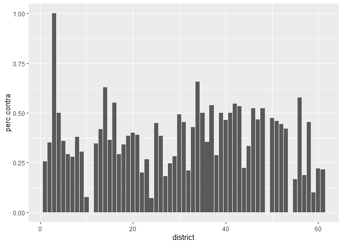
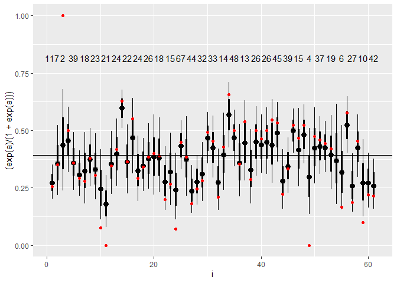
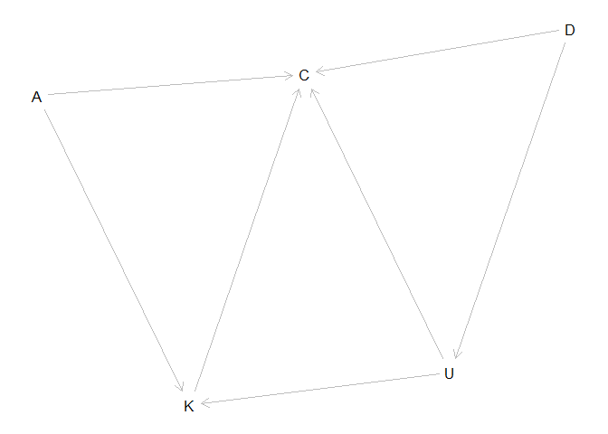
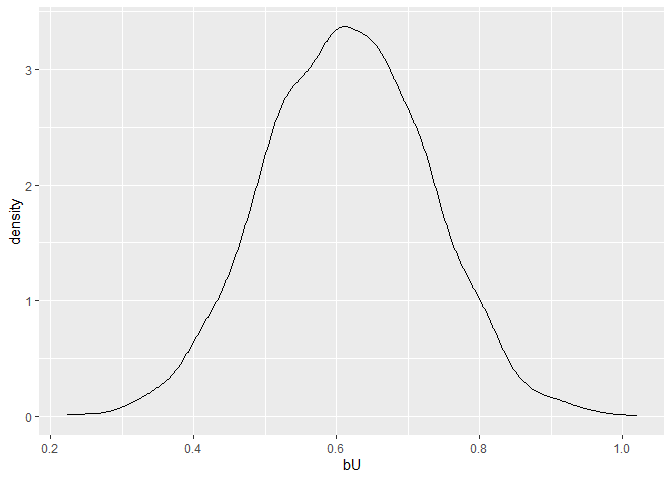
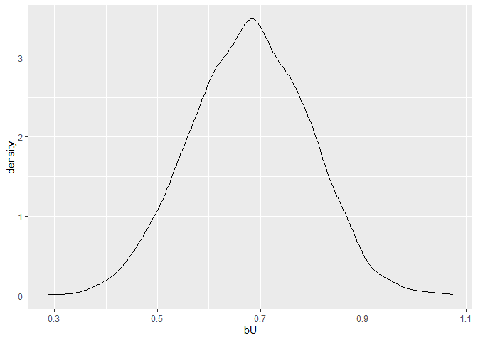

    library(dagitty)
    library(tidyverse)
    library(tidybayes)
    library(rstan)
    library(bayesplot)
    library(shinystan)

1.  The data in data(bangladesh) are 1934 women from the 1989 Bangladesh
    Fertility Survey. For each woman, we know which district she lived
    in, her number of living.children, her age.centered, whether she
    lived in an urban center, and finally whether or not she used
    contraception (use.contraception).

In this first problem, I only want you to investigate the proportion of
women using contraception in each district. Use partial pooling (varying
effects). Then compare the varying effect estimates to the raw empirical
proportion in each district. Explain the differences between the
estimates and the data.

Note that district number 54 is absent in the data. This causes some
problems in indexing the parameters. The simplest fix is just to tell
ulam manually how long the vector should be, like this: vector\[61\]:a ~
normal(abar,sigma). Pay special attention to district number 54’s
estimate.

    data(bangladesh, package = "rethinking")
    d <- bangladesh

    district <- d %>% 
      group_by(district) %>% 
      summarise(total = n(),
                use.contr = sum(use.contraception),
                perc.contra =  use.contr/total) 

    district %>% 
      ggplot(data = ., aes(x = district, y = perc.contra))+
      geom_col()

    dat <- list(
        C = d$use.contraception,
        A = d$age.centered,
        K = d$living.children,
        U = d$urban,
        D = as.integer(d$district),
        J = nrow(d)
    )

$$
C \\sim Bernoulli(p)\\\\
logit(p\_i) = \\alpha\_D\[i\] \\\\
\\alpha\_j \\sim Normal(\\bar{\\alpha}, sigma)\\\\
\\bar{\\alpha} \\sim Normal(0, 1)\\\\
sigma \\sim Exponential(1)
$$

    ## data {
    ##   int J;
    ##   int C[J];
    ##   int D[J];
    ## }
    ## parameters {
    ##   vector [61] a;
    ##   real abar;
    ##   real<lower=0> sigma;
    ## }
    ## model {
    ##   vector[J] p;
    ##   sigma ~ exponential( 1);
    ##   abar ~ normal(0, 1);
    ##   a ~ normal(abar, sigma);
    ##   for (i in 1:J) {
    ##     p[i] = a[D[i]];
    ##     p[i] = inv_logit(p[i]);
    ##   }
    ##   C ~ bernoulli(p);
    ## }

    m1 <- stan("model_1.stan", data=dat)

here is what the code looks like in stan:

    ## data {
    ##   int J;
    ##   int C[J];
    ##   int D[J];
    ## }
    ## parameters {
    ##   vector [61] a;
    ##   real abar;
    ##   real<lower=0> sigma;
    ## }
    ## model {
    ##   vector[J] p;
    ##   sigma ~ exponential( 1);
    ##   abar ~ normal(0, 1);
    ##   a ~ normal(abar, sigma);
    ##   for (i in 1:J) {
    ##     p[i] = a[D[i]];
    ##     p[i] = inv_logit(p[i]);
    ##   }
    ##   C ~ bernoulli(p);
    ## }

    x <- m1 %>%
     recover_types(dat) 

    gather <- gather_draws(x, a[i])

    spread_draws(x, a[i]) %>% 
      ggplot(aes(x = i, y =  (exp(a)/(1+exp(a)))))+
      stat_pointinterval()+
      geom_point(data = district, aes(x = district, y = perc.contra), col = "red")+
      geom_text(data = district, aes(label=total, x = district,  .8 ), vjust = 0, check_overlap = TRUE)+
      geom_hline(yintercept = sum(d$use.contraception)/nrow(d))

    bang_dag <- dagitty("dag {
                        A -> C <- D
                        K -> C <- U
                        A -> K
                        D -> U -> K
                        }")

    plot(bang_dag)

    ## Plot coordinates for graph not supplied! Generating coordinates, see ?coordinates for how to set your own.

    dagitty::adjustmentSets(bang_dag, 
                            exposure = "U",
                            outcome = "C")

    ## { D }

    m2 <- stan("model_2.stan", data=dat)

here is what the code looks like in stan:

    ## data {
    ##   int J;
    ##   int C[J];
    ##   int D[J];
    ##   int U[J];
    ## }
    ## parameters {
    ##   real bU;
    ##   vector [61] a;
    ##   real abar;
    ##   real<lower=0> sigma;
    ## }
    ## model {
    ##   vector[J] p;
    ##   sigma ~ exponential( 1);
    ##   abar ~ normal(0, 1);
    ##   a ~ normal(abar, sigma);
    ##   bU ~ normal(0 , 0.5);
    ##   for (i in 1:J) {
    ##     p[i] = a[D[i]]+ bU*U[i];
    ##     p[i] = inv_logit(p[i]);
    ##   }
    ##   C ~ bernoulli(p);
    ## }

    x <- m2 %>%
     recover_types(dat) 

    spread_draws(x, bU) %>% 
      ggplot(aes(x = bU))+
      geom_density()

    dat$Kprior <- rep(2, 3)

    m3 <- stan("model_3.stan", data=dat)

here is what the code looks like in stan:

    ## data {
    ##   int J;
    ##   int C[J];
    ##   int D[J];
    ##   int U[J];
    ##   int K[J];
    ##   vector[3] Kprior;
    ##   vector[J] A; 
    ## }
    ## parameters {
    ##   real bU;
    ##   real bA;
    ##   real bK;
    ##   simplex[3] delta;
    ##   vector [61] a;
    ##   real abar;
    ##   real<lower=0> sigma;
    ## }
    ## model {
    ##   vector[J] p;
    ##   vector[4] delta_j;
    ##   sigma ~ exponential( 1);
    ##   abar ~ normal(0, 1);
    ##   a ~ normal(abar, sigma);
    ##   delta ~ dirichlet(Kprior);
    ##   delta_j = append_row(0, delta);
    ##   bU ~ normal(0 , 0.5);
    ##   bA ~ normal(0 , 0.5);
    ##   bK ~ normal(0 , 0.5);
    ##   for (i in 1:J) {
    ##     p[i] = a[D[i]]+ bU*U[i] + bA*A[i] + bK*sum(delta_j[1:K[i]]);
    ##     p[i] = inv_logit(p[i]);
    ##   }
    ##   C ~ bernoulli(p);
    ## }

    x <- m3 %>%
     recover_types(dat) 

    spread_draws(x, bU) %>% 
      ggplot(aes(x = bU))+
      geom_density()

