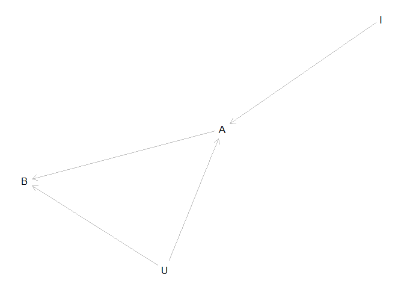

    library(tidyverse)

    ## Warning: package 'tidyverse' was built under R version 4.1.1

    ## -- Attaching packages --------------------------------------- tidyverse 1.3.1 --

    ## v ggplot2 3.3.5     v purrr   0.3.4
    ## v tibble  3.1.6     v dplyr   1.0.6
    ## v tidyr   1.1.3     v stringr 1.4.0
    ## v readr   1.4.0     v forcats 0.5.1

    ## Warning: package 'ggplot2' was built under R version 4.1.1

    ## Warning: package 'tibble' was built under R version 4.1.2

    ## Warning: package 'forcats' was built under R version 4.1.1

    ## -- Conflicts ------------------------------------------ tidyverse_conflicts() --
    ## x dplyr::filter() masks stats::filter()
    ## x dplyr::lag()    masks stats::lag()

    library(dagitty)

    ## Warning: package 'dagitty' was built under R version 4.1.2

    library(tidybayes)

    ## Warning: package 'tidybayes' was built under R version 4.1.2

    library(rstan)

    ## Warning: package 'rstan' was built under R version 4.1.2

    ## Loading required package: StanHeaders

    ## rstan (Version 2.21.3, GitRev: 2e1f913d3ca3)

    ## For execution on a local, multicore CPU with excess RAM we recommend calling
    ## options(mc.cores = parallel::detectCores()).
    ## To avoid recompilation of unchanged Stan programs, we recommend calling
    ## rstan_options(auto_write = TRUE)

    ## Do not specify '-march=native' in 'LOCAL_CPPFLAGS' or a Makevars file

    ## 
    ## Attaching package: 'rstan'

    ## The following object is masked from 'package:tidyr':
    ## 
    ##     extract

    library(bayesplot)

    ## Warning: package 'bayesplot' was built under R version 4.1.2

    ## This is bayesplot version 1.8.1

    ## - Online documentation and vignettes at mc-stan.org/bayesplot

    ## - bayesplot theme set to bayesplot::theme_default()

    ##    * Does _not_ affect other ggplot2 plots

    ##    * See ?bayesplot_theme_set for details on theme setting

    library(shinystan)

    ## Warning: package 'shinystan' was built under R version 4.1.2

    ## Loading required package: shiny

    ## 
    ## This is shinystan version 2.5.0

This material is mostly taken from Statistical rethinking chapter X.

How about a statistical puzzle? Consider the DAG below. we are
interested in the causal effect of A on B. Seems simple enough but
imagine there is also an Unobserved variable U that influences both A
and B. We cannot include U in our model as it is unmeasured. But we know
it is there and we need try and tease out the effect of A and not have
our estimates get muddled by U?

    instrument_dag <- dagitty("dag {
                        I -> A -> B <- U -> A
                        U [unobserved]
                        
                        }")

    plot(instrument_dag)

    ## Plot coordinates for graph not supplied! Generating coordinates, see ?coordinates for how to set your own.

First let’s generate data from this system. This will let us define the
effect of the variables on each other and generate a dataset. We will
then try a few modeling strategies on that data to try and extract the
correct effect of A on B.

    # I want to model standardized effects
    standardize <- function(vector) {
      x <- (vector - mean(vector))/ sd(vector)
    }

    # generate 500 observations
    set.seed(101)
    N <- 500
    U_sim <- rnorm( N )
    I_sim <- sample( 1:4 , size=N , replace=TRUE )
    A_sim <- rnorm( N , U_sim + I_sim )
    B_sim <- rnorm( N , U_sim + 1*A_sim )

    # df form for classical models
    dat_sim_df <- tibble(B = standardize(B_sim) ,
                         A = standardize(A_sim) ,
                         I = standardize(I_sim))

    # list form for the bayesian models
    dat_sim <- list(B = standardize(B_sim) ,
                    A = standardize(A_sim) ,
                    I = standardize(I_sim),
                    J = N)

Note: I set the effect of A on B as 5 so that will be the slope that we
will be on the look out for in our models.

## Classic linear regression

    fit <- lm(B~A, dat_sim_df) %>% summary()
    (sd(B_sim) * fit[["coefficients"]][2,1])/ sd(A_sim)

    ## [1] 1.269691

Wow… no that is quite a bit of an over estimation! This model is clearly
failing. So we have this I variable that

    fit2 <- lm(B~A+I, dat_sim_df) %>% summary()
    (sd(B_sim) * fit2[["coefficients"]][2,1])/ sd(A_sim)

    ## [1] 1.479626

That made things worse!

Well that is all of our variables… U is not something we can put in our
model. The causal salad approach of just throwing more variables at the
problem until it sorts itself out is not working here.

How can we recover our coefficient of 5 from this data? Well lets look
at some equations

    m1 <- stan("stan_model_multivar.stan", data=dat_sim)

here is what the code looks like in stan:

    ## //
    ## // This Stan program defines a simple model, with a
    ## // vector of values 'y' modeled as normally distributed
    ## // with mean 'mu' and standard deviation 'sigma'.
    ## //
    ## // Learn more about model development with Stan at:
    ## //
    ## //    http://mc-stan.org/users/interfaces/rstan.html
    ## //    https://github.com/stan-dev/rstan/wiki/RStan-Getting-Started
    ## //
    ## 
    ## // The input data is a vector 'y' of length 'N'.
    ## data {
    ##   int J;
    ##   vector[J] A;
    ##   vector[J] B;
    ##   vector[J] I;
    ## }
    ## 
    ## // The parameters accepted by the model. Our model
    ## // accepts two parameters 'mu' and 'sigma'.
    ## parameters {
    ##   real aA;
    ##   real aB;
    ##   real bIA;
    ##   real bAB;
    ##   corr_matrix[2] Rho;
    ##   vector<lower=0>[2] Sigma;
    ## }
    ## 
    ## // The model to be estimated. We model the output
    ## // 'y' to be normally distributed with mean 'mu'
    ## // and standard deviation 'sigma'.
    ## model {
    ##   
    ##   vector[500] muB;
    ##   vector[500] muA;
    ##   Sigma ~ exponential( 1 );
    ##   Rho ~ lkj_corr( 2 );
    ##   bAB ~ normal( 0 , 0.5 );
    ##   bIA ~ normal( 0 , 0.5 );
    ##   aB ~ normal( 0 , 0.2 );
    ##   aA ~ normal( 0 , 0.2 );
    ##   
    ##   
    ##   
    ##   for ( i in 1:500 ) muA[i] = aA + bIA * I[i];
    ##   for (i in 1:J)  muB[i] = aB + bAB * A[i];
    ##   
    ##   {
    ##   vector[2] YY[J];
    ##   vector[2] MU[J];
    ##   for (j in 1:J) MU[j] = [ muB[j], muA[j] ]';
    ##   for (j in 1:J) YY[j] = [ B[j], A[j] ]';
    ##   YY ~ multi_normal(MU, quad_form_diag(Rho, Sigma));
    ##   }
    ## }

    x <- m1 %>%
     recover_types(dat_sim) 

    y <- summary(m1)
    y[["summary"]]

    ##                   mean      se_mean           sd        2.5%         25%
    ## aA       -0.0012191400 5.651187e-04 3.394636e-02 -0.06843804 -0.02309847
    ## aB       -0.0006332874 4.196073e-04 2.398609e-02 -0.04790769 -0.01614722
    ## bIA       0.6382592145 6.275053e-04 3.404092e-02  0.57279062  0.61534721
    ## bAB       0.6651183163 8.444579e-04 3.697662e-02  0.59016200  0.64088029
    ## Rho[1,1]  1.0000000000          NaN 0.000000e+00  1.00000000  1.00000000
    ## Rho[1,2]  0.5002440710 1.190900e-03 5.109880e-02  0.39829064  0.46675431
    ## Rho[2,1]  0.5002440710 1.190900e-03 5.109880e-02  0.39829064  0.46675431
    ## Rho[2,2]  1.0000000000 1.349574e-18 8.301765e-17  1.00000000  1.00000000
    ## Sigma[1]  0.5332938701 4.905298e-04 2.207499e-02  0.49257501  0.51785573
    ## Sigma[2]  0.7678773155 4.090430e-04 2.446739e-02  0.72176069  0.75131302
    ## lp__     16.3237686779 4.220815e-02 1.848296e+00 12.05999009 15.27131268
    ##                    50%         75%       97.5%    n_eff      Rhat
    ## aA       -0.0008664172  0.02122431  0.06662652 3608.337 1.0001097
    ## aB       -0.0004813759  0.01552429  0.04605720 3267.631 1.0005670
    ## bIA       0.6383030254  0.66104884  0.70667829 2942.847 1.0008447
    ## bAB       0.6661078654  0.69067565  0.73511859 1917.337 1.0018265
    ## Rho[1,1]  1.0000000000  1.00000000  1.00000000      NaN       NaN
    ## Rho[1,2]  0.5005957825  0.53604513  0.59411549 1841.072 1.0014898
    ## Rho[2,1]  0.5005957825  0.53604513  0.59411549 1841.072 1.0014898
    ## Rho[2,2]  1.0000000000  1.00000000  1.00000000 3783.969 0.9989995
    ## Sigma[1]  0.5324659814  0.54801358  0.57886787 2025.211 1.0011405
    ## Sigma[2]  0.7676049014  0.78367202  0.81693154 3577.976 1.0002229
    ## lp__     16.6329765826 17.69259285 19.00891430 1917.566 1.0001387

    gather <- gather_draws(x, bAB) 

    sd(B_sim) * mean(gather$.value) / sd(A_sim)

    ## [1] 0.9684143

    m14.6 <- rethinking::ulam(
      alist(
        c(B, A) ~ multi_normal(c(muB, muA) , Rho , Sigma),
        muB <- aB + bAB * A,
        muA <- aA + bIA * I,
        c(aB, aA) ~ normal(0 , 0.2),
        c(bAB, bIA) ~ normal(0 , 0.5),
        Rho ~ lkj_corr(2),
        Sigma ~ exponential(1)
      ),
      data = dat_sim ,
      chains = 4 ,
      cores = 4
    )

    ## This is cmdstanr version 0.4.0

    ## - Online documentation and vignettes at mc-stan.org/cmdstanr

    ## - CmdStan path set to: C:/Users/gordo/Documents/.cmdstanr/cmdstan-2.28.2

    ## - Use set_cmdstan_path() to change the path

    ## 
    ## A newer version of CmdStan is available. See ?install_cmdstan() to install it.
    ## To disable this check set option or environment variable CMDSTANR_NO_VER_CHECK=TRUE.

    ## Running MCMC with 4 parallel chains, with 1 thread(s) per chain...
    ## 
    ## Chain 1 Iteration:   1 / 1000 [  0%]  (Warmup)

    ## Chain 1 Informational Message: The current Metropolis proposal is about to be rejected because of the following issue:

    ## Chain 1 Exception: lkj_corr_lpdf: Correlation matrix is not positive definite. (in 'C:/Users/gordo/AppData/Local/Temp/RtmpgF11Op/model-31941dd6f2c.stan', line 19, column 4 to column 24)

    ## Chain 1 If this warning occurs sporadically, such as for highly constrained variable types like covariance matrices, then the sampler is fine,

    ## Chain 1 but if this warning occurs often then your model may be either severely ill-conditioned or misspecified.

    ## Chain 1

    ## Chain 1 Informational Message: The current Metropolis proposal is about to be rejected because of the following issue:

    ## Chain 1 Exception: lkj_corr_lpdf: Correlation matrix is not positive definite. (in 'C:/Users/gordo/AppData/Local/Temp/RtmpgF11Op/model-31941dd6f2c.stan', line 19, column 4 to column 24)

    ## Chain 1 If this warning occurs sporadically, such as for highly constrained variable types like covariance matrices, then the sampler is fine,

    ## Chain 1 but if this warning occurs often then your model may be either severely ill-conditioned or misspecified.

    ## Chain 1

    ## Chain 1 Informational Message: The current Metropolis proposal is about to be rejected because of the following issue:

    ## Chain 1 Exception: lkj_corr_lpdf: Correlation matrix is not positive definite. (in 'C:/Users/gordo/AppData/Local/Temp/RtmpgF11Op/model-31941dd6f2c.stan', line 19, column 4 to column 24)

    ## Chain 1 If this warning occurs sporadically, such as for highly constrained variable types like covariance matrices, then the sampler is fine,

    ## Chain 1 but if this warning occurs often then your model may be either severely ill-conditioned or misspecified.

    ## Chain 1

    ## Chain 1 Informational Message: The current Metropolis proposal is about to be rejected because of the following issue:

    ## Chain 1 Exception: lkj_corr_lpdf: Correlation matrix is not positive definite. (in 'C:/Users/gordo/AppData/Local/Temp/RtmpgF11Op/model-31941dd6f2c.stan', line 19, column 4 to column 24)

    ## Chain 1 If this warning occurs sporadically, such as for highly constrained variable types like covariance matrices, then the sampler is fine,

    ## Chain 1 but if this warning occurs often then your model may be either severely ill-conditioned or misspecified.

    ## Chain 1

    ## Chain 1 Informational Message: The current Metropolis proposal is about to be rejected because of the following issue:

    ## Chain 1 Exception: lkj_corr_lpdf: Correlation matrix is not positive definite. (in 'C:/Users/gordo/AppData/Local/Temp/RtmpgF11Op/model-31941dd6f2c.stan', line 19, column 4 to column 24)

    ## Chain 1 If this warning occurs sporadically, such as for highly constrained variable types like covariance matrices, then the sampler is fine,

    ## Chain 1 but if this warning occurs often then your model may be either severely ill-conditioned or misspecified.

    ## Chain 1

    ## Chain 1 Informational Message: The current Metropolis proposal is about to be rejected because of the following issue:

    ## Chain 1 Exception: lkj_corr_lpdf: Correlation matrix is not positive definite. (in 'C:/Users/gordo/AppData/Local/Temp/RtmpgF11Op/model-31941dd6f2c.stan', line 19, column 4 to column 24)

    ## Chain 1 If this warning occurs sporadically, such as for highly constrained variable types like covariance matrices, then the sampler is fine,

    ## Chain 1 but if this warning occurs often then your model may be either severely ill-conditioned or misspecified.

    ## Chain 1

    ## Chain 2 Iteration:   1 / 1000 [  0%]  (Warmup)

    ## Chain 2 Informational Message: The current Metropolis proposal is about to be rejected because of the following issue:

    ## Chain 2 Exception: lkj_corr_lpdf: Correlation matrix is not positive definite. (in 'C:/Users/gordo/AppData/Local/Temp/RtmpgF11Op/model-31941dd6f2c.stan', line 19, column 4 to column 24)

    ## Chain 2 If this warning occurs sporadically, such as for highly constrained variable types like covariance matrices, then the sampler is fine,

    ## Chain 2 but if this warning occurs often then your model may be either severely ill-conditioned or misspecified.

    ## Chain 2

    ## Chain 2 Informational Message: The current Metropolis proposal is about to be rejected because of the following issue:

    ## Chain 2 Exception: lkj_corr_lpdf: Correlation matrix is not positive definite. (in 'C:/Users/gordo/AppData/Local/Temp/RtmpgF11Op/model-31941dd6f2c.stan', line 19, column 4 to column 24)

    ## Chain 2 If this warning occurs sporadically, such as for highly constrained variable types like covariance matrices, then the sampler is fine,

    ## Chain 2 but if this warning occurs often then your model may be either severely ill-conditioned or misspecified.

    ## Chain 2

    ## Chain 2 Informational Message: The current Metropolis proposal is about to be rejected because of the following issue:

    ## Chain 2 Exception: lkj_corr_lpdf: Correlation matrix is not positive definite. (in 'C:/Users/gordo/AppData/Local/Temp/RtmpgF11Op/model-31941dd6f2c.stan', line 19, column 4 to column 24)

    ## Chain 2 If this warning occurs sporadically, such as for highly constrained variable types like covariance matrices, then the sampler is fine,

    ## Chain 2 but if this warning occurs often then your model may be either severely ill-conditioned or misspecified.

    ## Chain 2

    ## Chain 2 Informational Message: The current Metropolis proposal is about to be rejected because of the following issue:

    ## Chain 2 Exception: lkj_corr_lpdf: Correlation matrix is not positive definite. (in 'C:/Users/gordo/AppData/Local/Temp/RtmpgF11Op/model-31941dd6f2c.stan', line 19, column 4 to column 24)

    ## Chain 2 If this warning occurs sporadically, such as for highly constrained variable types like covariance matrices, then the sampler is fine,

    ## Chain 2 but if this warning occurs often then your model may be either severely ill-conditioned or misspecified.

    ## Chain 2

    ## Chain 2 Informational Message: The current Metropolis proposal is about to be rejected because of the following issue:

    ## Chain 2 Exception: lkj_corr_lpdf: Correlation matrix is not positive definite. (in 'C:/Users/gordo/AppData/Local/Temp/RtmpgF11Op/model-31941dd6f2c.stan', line 19, column 4 to column 24)

    ## Chain 2 If this warning occurs sporadically, such as for highly constrained variable types like covariance matrices, then the sampler is fine,

    ## Chain 2 but if this warning occurs often then your model may be either severely ill-conditioned or misspecified.

    ## Chain 2

    ## Chain 2 Informational Message: The current Metropolis proposal is about to be rejected because of the following issue:

    ## Chain 2 Exception: multi_normal_lpdf: Covariance matrix is not symmetric. Covariance matrix[1,2] = 2.63996e+29, but Covariance matrix[2,1] = 2.63996e+29 (in 'C:/Users/gordo/AppData/Local/Temp/RtmpgF11Op/model-31941dd6f2c.stan', line 35, column 4 to column 58)

    ## Chain 2 If this warning occurs sporadically, such as for highly constrained variable types like covariance matrices, then the sampler is fine,

    ## Chain 2 but if this warning occurs often then your model may be either severely ill-conditioned or misspecified.

    ## Chain 2

    ## Chain 2 Informational Message: The current Metropolis proposal is about to be rejected because of the following issue:

    ## Chain 2 Exception: lkj_corr_lpdf: Correlation matrix is not positive definite. (in 'C:/Users/gordo/AppData/Local/Temp/RtmpgF11Op/model-31941dd6f2c.stan', line 19, column 4 to column 24)

    ## Chain 2 If this warning occurs sporadically, such as for highly constrained variable types like covariance matrices, then the sampler is fine,

    ## Chain 2 but if this warning occurs often then your model may be either severely ill-conditioned or misspecified.

    ## Chain 2

    ## Chain 2 Informational Message: The current Metropolis proposal is about to be rejected because of the following issue:

    ## Chain 2 Exception: lkj_corr_lpdf: Correlation matrix is not positive definite. (in 'C:/Users/gordo/AppData/Local/Temp/RtmpgF11Op/model-31941dd6f2c.stan', line 19, column 4 to column 24)

    ## Chain 2 If this warning occurs sporadically, such as for highly constrained variable types like covariance matrices, then the sampler is fine,

    ## Chain 2 but if this warning occurs often then your model may be either severely ill-conditioned or misspecified.

    ## Chain 2

    ## Chain 3 Iteration:   1 / 1000 [  0%]  (Warmup)

    ## Chain 3 Informational Message: The current Metropolis proposal is about to be rejected because of the following issue:

    ## Chain 3 Exception: lkj_corr_lpdf: Correlation matrix is not positive definite. (in 'C:/Users/gordo/AppData/Local/Temp/RtmpgF11Op/model-31941dd6f2c.stan', line 19, column 4 to column 24)

    ## Chain 3 If this warning occurs sporadically, such as for highly constrained variable types like covariance matrices, then the sampler is fine,

    ## Chain 3 but if this warning occurs often then your model may be either severely ill-conditioned or misspecified.

    ## Chain 3

    ## Chain 3 Informational Message: The current Metropolis proposal is about to be rejected because of the following issue:

    ## Chain 3 Exception: lkj_corr_lpdf: Correlation matrix is not positive definite. (in 'C:/Users/gordo/AppData/Local/Temp/RtmpgF11Op/model-31941dd6f2c.stan', line 19, column 4 to column 24)

    ## Chain 3 If this warning occurs sporadically, such as for highly constrained variable types like covariance matrices, then the sampler is fine,

    ## Chain 3 but if this warning occurs often then your model may be either severely ill-conditioned or misspecified.

    ## Chain 3

    ## Chain 3 Informational Message: The current Metropolis proposal is about to be rejected because of the following issue:

    ## Chain 3 Exception: lkj_corr_lpdf: Correlation matrix is not positive definite. (in 'C:/Users/gordo/AppData/Local/Temp/RtmpgF11Op/model-31941dd6f2c.stan', line 19, column 4 to column 24)

    ## Chain 3 If this warning occurs sporadically, such as for highly constrained variable types like covariance matrices, then the sampler is fine,

    ## Chain 3 but if this warning occurs often then your model may be either severely ill-conditioned or misspecified.

    ## Chain 3

    ## Chain 4 Iteration:   1 / 1000 [  0%]  (Warmup)

    ## Chain 4 Informational Message: The current Metropolis proposal is about to be rejected because of the following issue:

    ## Chain 4 Exception: lkj_corr_lpdf: Correlation matrix is not positive definite. (in 'C:/Users/gordo/AppData/Local/Temp/RtmpgF11Op/model-31941dd6f2c.stan', line 19, column 4 to column 24)

    ## Chain 4 If this warning occurs sporadically, such as for highly constrained variable types like covariance matrices, then the sampler is fine,

    ## Chain 4 but if this warning occurs often then your model may be either severely ill-conditioned or misspecified.

    ## Chain 4

    ## Chain 4 Informational Message: The current Metropolis proposal is about to be rejected because of the following issue:

    ## Chain 4 Exception: lkj_corr_lpdf: Correlation matrix is not positive definite. (in 'C:/Users/gordo/AppData/Local/Temp/RtmpgF11Op/model-31941dd6f2c.stan', line 19, column 4 to column 24)

    ## Chain 4 If this warning occurs sporadically, such as for highly constrained variable types like covariance matrices, then the sampler is fine,

    ## Chain 4 but if this warning occurs often then your model may be either severely ill-conditioned or misspecified.

    ## Chain 4

    ## Chain 4 Informational Message: The current Metropolis proposal is about to be rejected because of the following issue:

    ## Chain 4 Exception: lkj_corr_lpdf: Correlation matrix is not positive definite. (in 'C:/Users/gordo/AppData/Local/Temp/RtmpgF11Op/model-31941dd6f2c.stan', line 19, column 4 to column 24)

    ## Chain 4 If this warning occurs sporadically, such as for highly constrained variable types like covariance matrices, then the sampler is fine,

    ## Chain 4 but if this warning occurs often then your model may be either severely ill-conditioned or misspecified.

    ## Chain 4

    ## Chain 4 Informational Message: The current Metropolis proposal is about to be rejected because of the following issue:

    ## Chain 4 Exception: lkj_corr_lpdf: Correlation matrix is not positive definite. (in 'C:/Users/gordo/AppData/Local/Temp/RtmpgF11Op/model-31941dd6f2c.stan', line 19, column 4 to column 24)

    ## Chain 4 If this warning occurs sporadically, such as for highly constrained variable types like covariance matrices, then the sampler is fine,

    ## Chain 4 but if this warning occurs often then your model may be either severely ill-conditioned or misspecified.

    ## Chain 4

    ## Chain 4 Informational Message: The current Metropolis proposal is about to be rejected because of the following issue:

    ## Chain 4 Exception: lkj_corr_lpdf: Correlation matrix is not positive definite. (in 'C:/Users/gordo/AppData/Local/Temp/RtmpgF11Op/model-31941dd6f2c.stan', line 19, column 4 to column 24)

    ## Chain 4 If this warning occurs sporadically, such as for highly constrained variable types like covariance matrices, then the sampler is fine,

    ## Chain 4 but if this warning occurs often then your model may be either severely ill-conditioned or misspecified.

    ## Chain 4

    ## Chain 4 Informational Message: The current Metropolis proposal is about to be rejected because of the following issue:

    ## Chain 4 Exception: multi_normal_lpdf: Covariance matrix is not symmetric. Covariance matrix[1,2] = -9.87945e+09, but Covariance matrix[2,1] = -9.87945e+09 (in 'C:/Users/gordo/AppData/Local/Temp/RtmpgF11Op/model-31941dd6f2c.stan', line 35, column 4 to column 58)

    ## Chain 4 If this warning occurs sporadically, such as for highly constrained variable types like covariance matrices, then the sampler is fine,

    ## Chain 4 but if this warning occurs often then your model may be either severely ill-conditioned or misspecified.

    ## Chain 4

    ## Chain 4 Informational Message: The current Metropolis proposal is about to be rejected because of the following issue:

    ## Chain 4 Exception: lkj_corr_lpdf: Correlation matrix is not positive definite. (in 'C:/Users/gordo/AppData/Local/Temp/RtmpgF11Op/model-31941dd6f2c.stan', line 19, column 4 to column 24)

    ## Chain 4 If this warning occurs sporadically, such as for highly constrained variable types like covariance matrices, then the sampler is fine,

    ## Chain 4 but if this warning occurs often then your model may be either severely ill-conditioned or misspecified.

    ## Chain 4

    ## Chain 4 Informational Message: The current Metropolis proposal is about to be rejected because of the following issue:

    ## Chain 4 Exception: lkj_corr_lpdf: Correlation matrix is not positive definite. (in 'C:/Users/gordo/AppData/Local/Temp/RtmpgF11Op/model-31941dd6f2c.stan', line 19, column 4 to column 24)

    ## Chain 4 If this warning occurs sporadically, such as for highly constrained variable types like covariance matrices, then the sampler is fine,

    ## Chain 4 but if this warning occurs often then your model may be either severely ill-conditioned or misspecified.

    ## Chain 4

    ## Chain 2 Iteration: 100 / 1000 [ 10%]  (Warmup) 
    ## Chain 4 Iteration: 100 / 1000 [ 10%]  (Warmup) 
    ## Chain 1 Iteration: 100 / 1000 [ 10%]  (Warmup) 
    ## Chain 3 Iteration: 100 / 1000 [ 10%]  (Warmup) 
    ## Chain 4 Iteration: 200 / 1000 [ 20%]  (Warmup) 
    ## Chain 1 Iteration: 200 / 1000 [ 20%]  (Warmup) 
    ## Chain 2 Iteration: 200 / 1000 [ 20%]  (Warmup) 
    ## Chain 3 Iteration: 200 / 1000 [ 20%]  (Warmup) 
    ## Chain 4 Iteration: 300 / 1000 [ 30%]  (Warmup) 
    ## Chain 1 Iteration: 300 / 1000 [ 30%]  (Warmup) 
    ## Chain 2 Iteration: 300 / 1000 [ 30%]  (Warmup) 
    ## Chain 3 Iteration: 300 / 1000 [ 30%]  (Warmup) 
    ## Chain 4 Iteration: 400 / 1000 [ 40%]  (Warmup) 
    ## Chain 1 Iteration: 400 / 1000 [ 40%]  (Warmup) 
    ## Chain 2 Iteration: 400 / 1000 [ 40%]  (Warmup) 
    ## Chain 3 Iteration: 400 / 1000 [ 40%]  (Warmup) 
    ## Chain 4 Iteration: 500 / 1000 [ 50%]  (Warmup) 
    ## Chain 2 Iteration: 500 / 1000 [ 50%]  (Warmup) 
    ## Chain 4 Iteration: 501 / 1000 [ 50%]  (Sampling) 
    ## Chain 1 Iteration: 500 / 1000 [ 50%]  (Warmup) 
    ## Chain 2 Iteration: 501 / 1000 [ 50%]  (Sampling) 
    ## Chain 1 Iteration: 501 / 1000 [ 50%]  (Sampling) 
    ## Chain 3 Iteration: 500 / 1000 [ 50%]  (Warmup) 
    ## Chain 3 Iteration: 501 / 1000 [ 50%]  (Sampling) 
    ## Chain 4 Iteration: 600 / 1000 [ 60%]  (Sampling) 
    ## Chain 2 Iteration: 600 / 1000 [ 60%]  (Sampling) 
    ## Chain 1 Iteration: 600 / 1000 [ 60%]  (Sampling) 
    ## Chain 2 Iteration: 700 / 1000 [ 70%]  (Sampling) 
    ## Chain 3 Iteration: 600 / 1000 [ 60%]  (Sampling) 
    ## Chain 4 Iteration: 700 / 1000 [ 70%]  (Sampling) 
    ## Chain 1 Iteration: 700 / 1000 [ 70%]  (Sampling) 
    ## Chain 3 Iteration: 700 / 1000 [ 70%]  (Sampling) 
    ## Chain 2 Iteration: 800 / 1000 [ 80%]  (Sampling) 
    ## Chain 4 Iteration: 800 / 1000 [ 80%]  (Sampling) 
    ## Chain 1 Iteration: 800 / 1000 [ 80%]  (Sampling) 
    ## Chain 3 Iteration: 800 / 1000 [ 80%]  (Sampling) 
    ## Chain 4 Iteration: 900 / 1000 [ 90%]  (Sampling) 
    ## Chain 2 Iteration: 900 / 1000 [ 90%]  (Sampling) 
    ## Chain 1 Iteration: 900 / 1000 [ 90%]  (Sampling) 
    ## Chain 3 Iteration: 900 / 1000 [ 90%]  (Sampling) 
    ## Chain 4 Iteration: 1000 / 1000 [100%]  (Sampling) 
    ## Chain 4 finished in 6.1 seconds.
    ## Chain 2 Iteration: 1000 / 1000 [100%]  (Sampling) 
    ## Chain 2 finished in 6.2 seconds.
    ## Chain 1 Iteration: 1000 / 1000 [100%]  (Sampling) 
    ## Chain 1 finished in 6.4 seconds.
    ## Chain 3 Iteration: 1000 / 1000 [100%]  (Sampling) 
    ## Chain 3 finished in 6.6 seconds.
    ## 
    ## All 4 chains finished successfully.
    ## Mean chain execution time: 6.3 seconds.
    ## Total execution time: 6.8 seconds.

    rethinking::precis(m14.6 , depth = 3)

    ##                   mean         sd        5.5%      94.5%    n_eff    Rhat4
    ## aA       -0.0005381545 0.03427128 -0.05752391 0.05402384 1672.659 1.000483
    ## aB        0.0001862405 0.02364076 -0.03960571 0.03754676 1502.326 1.000084
    ## bIA       0.6363627590 0.03486944  0.57994686 0.69158257 1377.243 1.002139
    ## bAB       0.6622559370 0.03706932  0.60139934 0.72198825 1244.873 1.001580
    ## Rho[1,1]  1.0000000000 0.00000000  1.00000000 1.00000000      NaN      NaN
    ## Rho[1,2]  0.5038695195 0.05113839  0.41727025 0.58185870 1219.901 1.001909
    ## Rho[2,1]  0.5038695195 0.05113839  0.41727025 0.58185870 1219.901 1.001909
    ## Rho[2,2]  1.0000000000 0.00000000  1.00000000 1.00000000      NaN      NaN
    ## Sigma[1]  0.5343220880 0.02195847  0.50082021 0.56941537 1396.389 1.001089
    ## Sigma[2]  0.7682845260 0.02410544  0.73053109 0.80658505 1300.246 1.004558

    rethinking::stancode(m14.6)

    ## data{
    ##     int J;
    ##     vector[500] B;
    ##     vector[500] A;
    ##     vector[500] I;
    ## }
    ## parameters{
    ##     real aA;
    ##     real aB;
    ##     real bIA;
    ##     real bAB;
    ##     corr_matrix[2] Rho;
    ##     vector<lower=0>[2] Sigma;
    ## }
    ## model{
    ##     vector[500] muB;
    ##     vector[500] muA;
    ##     Sigma ~ exponential( 1 );
    ##     Rho ~ lkj_corr( 2 );
    ##     bAB ~ normal( 0 , 0.5 );
    ##     bIA ~ normal( 0 , 0.5 );
    ##     aB ~ normal( 0 , 0.2 );
    ##     aA ~ normal( 0 , 0.2 );
    ##     for ( i in 1:500 ) {
    ##         muA[i] = aA + bIA * I[i];
    ##     }
    ##     for ( i in 1:500 ) {
    ##         muB[i] = aB + bAB * A[i];
    ##     }
    ##     {
    ##     vector[2] YY[500];
    ##     vector[2] MU[500];
    ##     for ( j in 1:500 ) MU[j] = [ muB[j] , muA[j] ]';
    ##     for ( j in 1:500 ) YY[j] = [ B[j] , A[j] ]';
    ##     YY ~ multi_normal( MU , quad_form_diag(Rho , Sigma) );
    ##     }
    ## }

    sd(B_sim) *1.22

    ## [1] 3.358155

    sd(B_sim) *1.22

    ## [1] 3.358155

First I want to prove to you that this works. All I do below is simulate
a vector of random numbers then I simulate vector B by multiplying the
means of A by and sampling from that.

I then fit a linear model B ~ A and extract the slope coefficient for A
and get it back into non standard terms. We should extract the number 5.
That will tell us that we can infact model interactions this way.

    set.seed(101)
    N <- 5000
    A_sim <- rnorm( N )
    B_sim <- rnorm( N , 5*A_sim )

    dat_sim_df <- tibble(B = standardize(B_sim) ,
                         A = standardize(A_sim))

    fit <- lm(B~A, dat_sim_df) %>% summary()
    sd(B_sim) * fit[["coefficients"]][2,1]

    ## [1] 4.997525

Ta-Da!

Great
