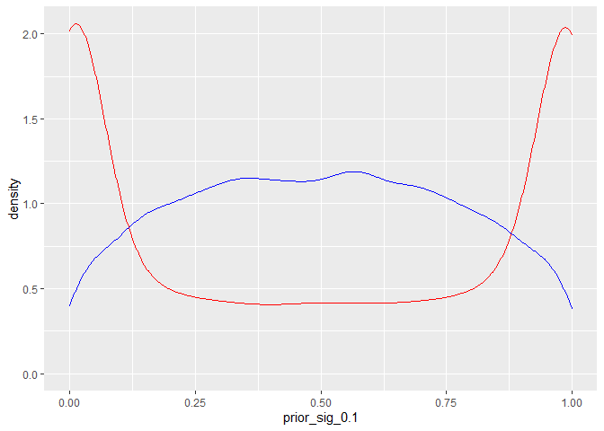
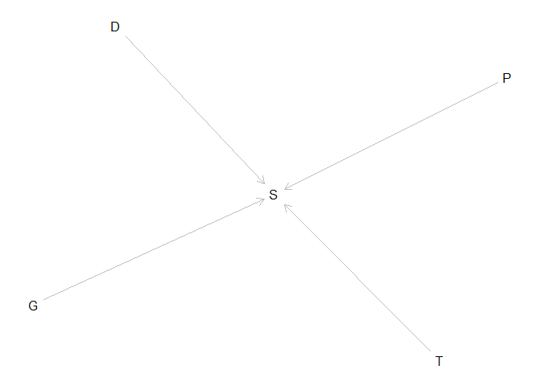
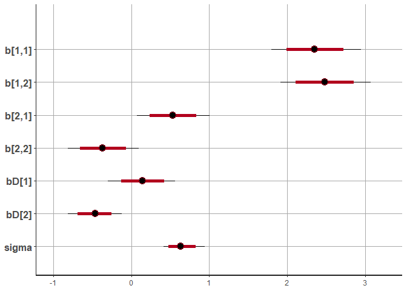

    library(dagitty)
    library(tidyverse)
    library(tidybayes)
    library(rstan)
    library(bayesplot)
    library(shinystan)

This examples comes from the week 6 homework for the stats rethinking
courese. I have modified it to work off stan. Rethinking is only called
to get the data and then the package is removed. I want to try and
bridge the gap from the Rethinking package toward real world tools.

**1. Conduct a prior predictive simulation for the Reedfrog model. By
this I mean to simulate the prior distribution of tank survival
probabilities αj. Start by using this prior:**

$$
\\alpha\_j \\sim Normal(\\bar{\\alpha}, \\sigma)\\\\
\\bar{\\alpha} \\sim Normal(0,1) \\\\
\\sigma \\sim Exponential(1)
$$

**Be sure to transform the αj values to the probability scale for
plotting and summary. How does increasing the width of the prior on σ
change the prior distribution of αj? You might try Exponential(10) and
Exponential(0.1) for example.**

    n <- 1e4

    prior_test <- tibble(
      sigma_0.1 = rexp(n, 0.1),
      sigma_1.0 = rexp(n, 1.0),
      a_bar = rnorm(n, 0, 1)
    ) %>%
      mutate(
        # create prior distributions
        prior_sig_0.1 = rnorm(n, a_bar, sigma_0.1),
        prior_sig_1.0 = rnorm(n, a_bar, sigma_1.0),
        
        # convert both to inverse logits
        prior_sig_0.1 = exp(prior_sig_0.1) / (1 + exp(prior_sig_0.1)),
        prior_sig_1.0 = exp(prior_sig_1.0) / (1 + exp(prior_sig_1.0))
      )

    ggplot(data = prior_test)+ 
      geom_density(aes(x=prior_sig_0.1), color = "red")+
      geom_density(aes(x=prior_sig_1.0), color = "blue")

The main point of this exercise is to see that flat priors on one scale
are not flat on another.

**2. Revisit the Reedfrog survival data, data(reedfrogs). Start with the
varying effects model from the book and lecture. Then modify it to
estimate the causal effects of the treatment variables pred and size,
including how size might modify the effect of predation. An easy
approach is to estimate an effect for each combination of pred and size.
Justify your model with a DAG of this experiment.**

    tadpole_dag <- dagitty( "dag {
                        P -> S <- G
                        T -> S <- D
                        }")

    plot(tadpole_dag)

    Plot coordinates for graph not supplied! Generating coordinates, see ?coordinates for how to set your own.

    data(reedfrogs, package = "rethinking")
    d <- reedfrogs

    dat <- list(
        S = d$surv,
        D = d$density,
        T = 1:nrow(d),
        P = ifelse( d$pred=="no" , 1L , 2L ),
        G = ifelse( d$size=="small" , 1L , 2L )
    )

here is what the code looks like in stan:

    data{
        int D[48];
        int S[48];
        int G[48];
        int P[48];
        int T[48];
    }
    parameters{
        vector[48] a;
        matrix[2,2] b;
        real<lower=0> sigma;
    }
    model{
        vector[48] p;
        sigma ~ exponential( 1 );
        to_vector( b ) ~ normal( 0 , 1 );
        a ~ normal( 0 , sigma );
        for ( i in 1:48 ) {
            p[i] = a[T[i]] + b[P[i], G[i]];
            p[i] = inv_logit(p[i]);
        }
        S ~ binomial( D , p );
    }
    generated quantities{
        vector[48] log_lik;
        vector[48] p;
        for ( i in 1:48 ) {
            p[i] = a[T[i]] + b[P[i], G[i]];
            p[i] = inv_logit(p[i]);
        }
        for ( i in 1:48 ) log_lik[i] = binomial_lpmf( S[i] | D[i] , p[i] );
    }

Now here is how you pass the data to the stan script

    m2 <- stan("question_two_model.stan", data=dat)

And let’s take a look at the output

    print(m2, probs=c(0.25, 0.5, 0.75), pars=c("b", "sigma") , include=TRUE)

    Inference for Stan model: question_two_model.
    4 chains, each with iter=2000; warmup=1000; thin=1; 
    post-warmup draws per chain=1000, total post-warmup draws=4000.

            mean se_mean   sd   25%   50%   75% n_eff Rhat
    b[1,1]  2.37    0.00 0.30  2.17  2.37  2.56  3754    1
    b[1,2]  2.50    0.00 0.31  2.30  2.50  2.71  4030    1
    b[2,1]  0.44    0.01 0.25  0.28  0.44  0.60  2373    1
    b[2,2] -0.42    0.01 0.25 -0.59 -0.42 -0.25  2475    1
    sigma   0.73    0.00 0.14  0.63  0.72  0.82  1222    1

    Samples were drawn using NUTS(diag_e) at Sun Feb 20 20:32:55 2022.
    For each parameter, n_eff is a crude measure of effective sample size,
    and Rhat is the potential scale reduction factor on split chains (at 
    convergence, Rhat=1).

    plot(m2, pars=c("b", "sigma"))

    ci_level: 0.8 (80% intervals)

    outer_level: 0.95 (95% intervals)

**3. Now estimate the causal effect of density on survival. Consider
whether pred modifies the effect of density. There are several good ways
to include density in your Binomial GLM. You could treat it as a
continuous regression variable (possibly standardized). Or you could
convert it to an ordered category (with three levels). Compare the σ
(tank standard deviation) posterior distribution to σ from your model in
Problem 2. How are they different? Why?**

Now we want to do density as a standardized log version of itself.

    log_dens <- log(d$density)
    stand_log_dens <- (log_dens - mean(log_dens)) / sd(log_dens)
    dat$Do <- stand_log_dens

    SAMPLING FOR MODEL 'question_three_model' NOW (CHAIN 1).
    Chain 1: 
    Chain 1: Gradient evaluation took 0 seconds
    Chain 1: 1000 transitions using 10 leapfrog steps per transition would take 0 seconds.
    Chain 1: Adjust your expectations accordingly!
    Chain 1: 
    Chain 1: 
    Chain 1: Iteration:    1 / 2000 [  0%]  (Warmup)
    Chain 1: Iteration:  200 / 2000 [ 10%]  (Warmup)
    Chain 1: Iteration:  400 / 2000 [ 20%]  (Warmup)
    Chain 1: Iteration:  600 / 2000 [ 30%]  (Warmup)
    Chain 1: Iteration:  800 / 2000 [ 40%]  (Warmup)
    Chain 1: Iteration: 1000 / 2000 [ 50%]  (Warmup)
    Chain 1: Iteration: 1001 / 2000 [ 50%]  (Sampling)
    Chain 1: Iteration: 1200 / 2000 [ 60%]  (Sampling)
    Chain 1: Iteration: 1400 / 2000 [ 70%]  (Sampling)
    Chain 1: Iteration: 1600 / 2000 [ 80%]  (Sampling)
    Chain 1: Iteration: 1800 / 2000 [ 90%]  (Sampling)
    Chain 1: Iteration: 2000 / 2000 [100%]  (Sampling)
    Chain 1: 
    Chain 1:  Elapsed Time: 0.28 seconds (Warm-up)
    Chain 1:                0.263 seconds (Sampling)
    Chain 1:                0.543 seconds (Total)
    Chain 1: 

    SAMPLING FOR MODEL 'question_three_model' NOW (CHAIN 2).
    Chain 2: 
    Chain 2: Gradient evaluation took 0 seconds
    Chain 2: 1000 transitions using 10 leapfrog steps per transition would take 0 seconds.
    Chain 2: Adjust your expectations accordingly!
    Chain 2: 
    Chain 2: 
    Chain 2: Iteration:    1 / 2000 [  0%]  (Warmup)
    Chain 2: Iteration:  200 / 2000 [ 10%]  (Warmup)
    Chain 2: Iteration:  400 / 2000 [ 20%]  (Warmup)
    Chain 2: Iteration:  600 / 2000 [ 30%]  (Warmup)
    Chain 2: Iteration:  800 / 2000 [ 40%]  (Warmup)
    Chain 2: Iteration: 1000 / 2000 [ 50%]  (Warmup)
    Chain 2: Iteration: 1001 / 2000 [ 50%]  (Sampling)
    Chain 2: Iteration: 1200 / 2000 [ 60%]  (Sampling)
    Chain 2: Iteration: 1400 / 2000 [ 70%]  (Sampling)
    Chain 2: Iteration: 1600 / 2000 [ 80%]  (Sampling)
    Chain 2: Iteration: 1800 / 2000 [ 90%]  (Sampling)
    Chain 2: Iteration: 2000 / 2000 [100%]  (Sampling)
    Chain 2: 
    Chain 2:  Elapsed Time: 0.269 seconds (Warm-up)
    Chain 2:                0.267 seconds (Sampling)
    Chain 2:                0.536 seconds (Total)
    Chain 2: 

    SAMPLING FOR MODEL 'question_three_model' NOW (CHAIN 3).
    Chain 3: 
    Chain 3: Gradient evaluation took 0 seconds
    Chain 3: 1000 transitions using 10 leapfrog steps per transition would take 0 seconds.
    Chain 3: Adjust your expectations accordingly!
    Chain 3: 
    Chain 3: 
    Chain 3: Iteration:    1 / 2000 [  0%]  (Warmup)
    Chain 3: Iteration:  200 / 2000 [ 10%]  (Warmup)
    Chain 3: Iteration:  400 / 2000 [ 20%]  (Warmup)
    Chain 3: Iteration:  600 / 2000 [ 30%]  (Warmup)
    Chain 3: Iteration:  800 / 2000 [ 40%]  (Warmup)
    Chain 3: Iteration: 1000 / 2000 [ 50%]  (Warmup)
    Chain 3: Iteration: 1001 / 2000 [ 50%]  (Sampling)
    Chain 3: Iteration: 1200 / 2000 [ 60%]  (Sampling)
    Chain 3: Iteration: 1400 / 2000 [ 70%]  (Sampling)
    Chain 3: Iteration: 1600 / 2000 [ 80%]  (Sampling)
    Chain 3: Iteration: 1800 / 2000 [ 90%]  (Sampling)
    Chain 3: Iteration: 2000 / 2000 [100%]  (Sampling)
    Chain 3: 
    Chain 3:  Elapsed Time: 0.274 seconds (Warm-up)
    Chain 3:                0.276 seconds (Sampling)
    Chain 3:                0.55 seconds (Total)
    Chain 3: 

    SAMPLING FOR MODEL 'question_three_model' NOW (CHAIN 4).
    Chain 4: 
    Chain 4: Gradient evaluation took 0 seconds
    Chain 4: 1000 transitions using 10 leapfrog steps per transition would take 0 seconds.
    Chain 4: Adjust your expectations accordingly!
    Chain 4: 
    Chain 4: 
    Chain 4: Iteration:    1 / 2000 [  0%]  (Warmup)
    Chain 4: Iteration:  200 / 2000 [ 10%]  (Warmup)
    Chain 4: Iteration:  400 / 2000 [ 20%]  (Warmup)
    Chain 4: Iteration:  600 / 2000 [ 30%]  (Warmup)
    Chain 4: Iteration:  800 / 2000 [ 40%]  (Warmup)
    Chain 4: Iteration: 1000 / 2000 [ 50%]  (Warmup)
    Chain 4: Iteration: 1001 / 2000 [ 50%]  (Sampling)
    Chain 4: Iteration: 1200 / 2000 [ 60%]  (Sampling)
    Chain 4: Iteration: 1400 / 2000 [ 70%]  (Sampling)
    Chain 4: Iteration: 1600 / 2000 [ 80%]  (Sampling)
    Chain 4: Iteration: 1800 / 2000 [ 90%]  (Sampling)
    Chain 4: Iteration: 2000 / 2000 [100%]  (Sampling)
    Chain 4: 
    Chain 4:  Elapsed Time: 0.273 seconds (Warm-up)
    Chain 4:                0.272 seconds (Sampling)
    Chain 4:                0.545 seconds (Total)
    Chain 4: 

Now compare the estimates:

    print(m3, probs=c(0.25, 0.5, 0.75), pars=c("b", "bD", "sigma") , include=TRUE)

    Inference for Stan model: question_three_model.
    4 chains, each with iter=2000; warmup=1000; thin=1; 
    post-warmup draws per chain=1000, total post-warmup draws=4000.

            mean se_mean   sd   25%   50%   75% n_eff Rhat
    b[1,1]  2.35       0 0.29  2.15  2.35  2.54  4064    1
    b[1,2]  2.48       0 0.30  2.28  2.48  2.69  4186    1
    b[2,1]  0.54       0 0.24  0.38  0.54  0.69  2918    1
    b[2,2] -0.36       0 0.23 -0.52 -0.36 -0.20  2869    1
    bD[1]   0.14       0 0.21  0.00  0.15  0.28  4649    1
    bD[2]  -0.47       0 0.18 -0.58 -0.47 -0.35  3596    1
    sigma   0.65       0 0.14  0.55  0.64  0.73   989    1

    Samples were drawn using NUTS(diag_e) at Sun Feb 20 20:33:18 2022.
    For each parameter, n_eff is a crude measure of effective sample size,
    and Rhat is the potential scale reduction factor on split chains (at 
    convergence, Rhat=1).

    plot(m3, pars=c("b", "bD", "sigma"))

    ci_level: 0.8 (80% intervals)

    outer_level: 0.95 (95% intervals)

